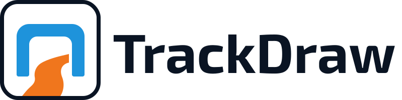

<p align="center">
  
</p>

<p align="center">
  Design FPV drone racing tracks in your browser — true to scale, in 2D and 3D.
</p>

---

TrackDraw is a free, browser-based track designer built for FPV drone racing pilots and event organisers. Open the studio, drop your obstacles on the canvas, tweak the layout until it feels right, and share the result with your team using a single link — no account required.

TrackDraw is currently in beta and still actively evolving. Expect rapid UI changes, feature tweaks and occasional rough edges while the editor matures.

## What you can do

- 🏁 **Place obstacles** - gates, flags, cones, dive gates, ladders, start/finish lines, labels and free-form polylines
- 📐 **Work to scale** - the canvas maps directly to real-world dimensions; set your field size and meters-per-pixel ratio to get accurate distances
- 🎥 **Preview in 3D** - a live Three.js render shows the track from a drone perspective as you build
- 📈 **Check elevation** - altitude profile chart along polyline paths, useful for planning vertical sections
- ↩️ **Undo anything** - full undo/redo history so you can experiment freely
- 📤 **Export** - save your design as PNG, SVG or PDF to print or share offline
- 🔗 **Share with a link** - the entire design is compressed into the URL; send it to anyone and they see the exact same track
- 📥 **Import** - load a previously saved design file to continue editing

## Getting started

```bash
npm install
npm run dev
```

Open [http://localhost:3000](http://localhost:3000). The studio is at `/studio`.

## How it works

1. **Pick a tool** from the toolbar (gate, cone, flag, etc.)
2. **Click on the canvas** to place obstacles — drag to reposition, click to select and edit properties
3. **Use the inspector panel** on the right to fine-tune size, rotation, colour and other shape properties
4. **Right-click a selected item** in the 2D canvas for quick actions like duplicate, lock/unlock, arrange, rotate and delete
5. **Toggle the 3D panel** to preview your layout from above or in perspective, and click items there to inspect them without losing selection while orbiting
6. **Hit Share** to get a URL you can send directly to pilots or co-organisers

## Useful shortcuts

- `V` select mode
- `H` hand / pan mode
- `G`, `F`, `C`, `L`, `P`, `S`, `R`, `D` switch tools
- `Arrow keys` nudge selected items by the grid step
- `Alt` + `Arrow keys` nudge selected items by `0.1m`
- `Q` / `[` rotate selected items left by `15°`
- `E` / `]` rotate selected items right by `15°`
- `Shift` + `Q` / `E` or `[` / `]` rotate by `5°`
- `Alt` + `Q` / `E` or `[` / `]` rotate by `1°`
- Drag the 2D rotate handle to snap in `5°` steps
- Hold `Alt` while dragging the 2D rotate handle to snap in `1°` steps
- `Ctrl/Cmd + D` duplicate selection
- `Ctrl/Cmd + C`, `Ctrl/Cmd + V` copy and paste
- `Delete` remove selection
- `0` fit the field back into view

## Tech stack

| Layer      | Library                                                   |
| ---------- | --------------------------------------------------------- |
| Framework  | Next.js 16 (App Router, Turbopack)                        |
| UI         | React 19, Tailwind CSS 4, shadcn/ui v4 (`@base-ui/react`) |
| 2D canvas  | Konva 10 + react-konva                                    |
| 3D preview | Three.js 0.175 + @react-three/fiber + drei                |
| State      | Zustand 5 + zundo 2 (temporal) + Immer                    |
| Export     | jsPDF, Konva stage snapshots                              |
| Sharing    | lz-string                                                 |
| Icons      | Lucide React                                              |

## Project structure

```
src/
├── app/              # Next.js pages (/, /studio, /share)
├── components/       # React components
│   ├── EditorShell   # Layout orchestrator
│   ├── TrackCanvas   # Konva 2D editor
│   ├── Inspector     # Shape properties panel
│   ├── TrackPreview3D
│   ├── ElevationChart / ElevationPanel
│   ├── Header / Toolbar / StatusBar
│   ├── ExportDialog / ImportDialog / ShareDialog
│   ├── landing/      # Marketing page components
│   └── ui/           # @base-ui/react wrappers
├── store/
│   └── editor.ts     # Zustand store with temporal undo history
├── hooks/            # useUndoRedo, useTheme, useShareUrl
└── lib/
    ├── geometry.ts   # Distance, Catmull-Rom smoothing, elevation sampling
    ├── share.ts      # LZ-string encode/decode
    ├── export/       # PNG / SVG / PDF export
    └── types.ts      # Shape union types, TrackDesign, FieldSpec
```

## Scripts

```bash
npm run dev    # Development server (Turbopack)
npm run build  # Production build
npm run start  # Production server
npm run lint   # ESLint
```

## License

Distributed under the **LGPL-3.0-or-later** License. See [`LICENSE`](LICENSE) for more information.
